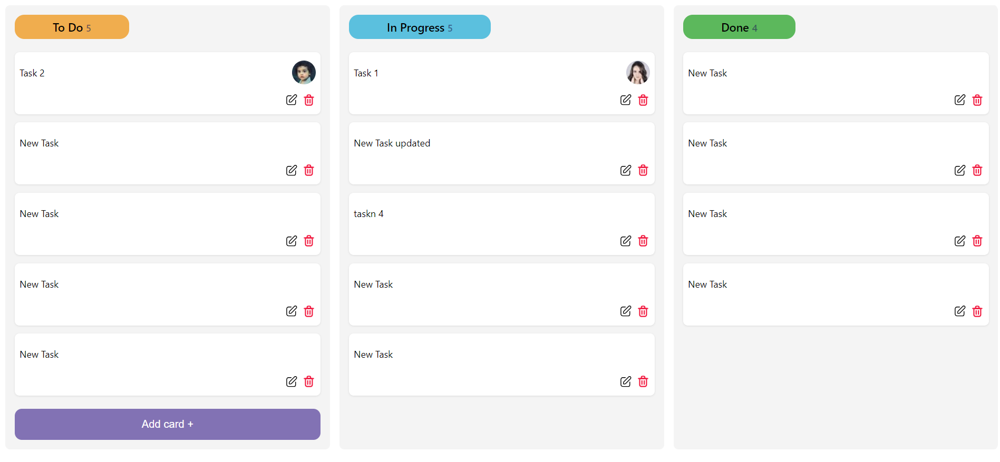
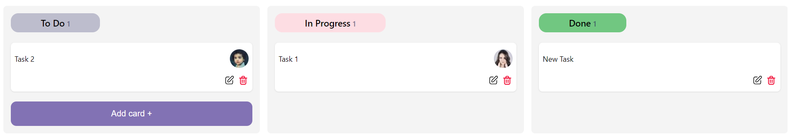
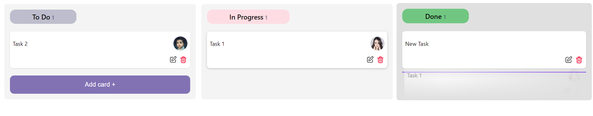
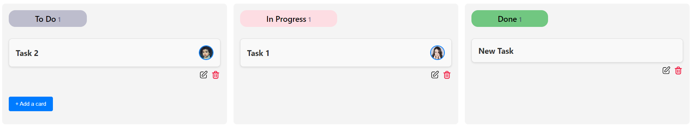
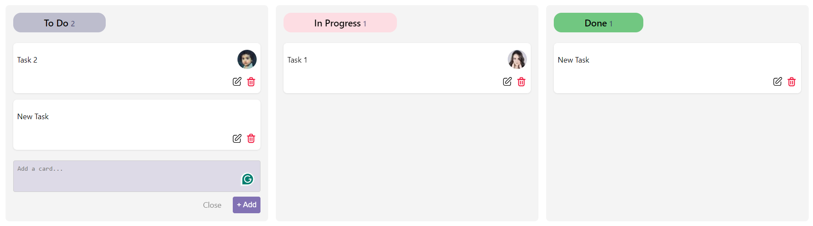
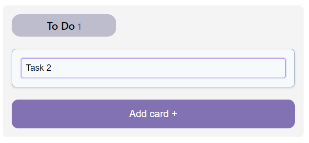

# KanbanBoard React Component

A flexible and customizable Kanban board component for React applications. The `KanbanBoard` component allows you to create interactive and draggable task cards organized into columns, making it ideal for project management and task tracking.

### KanbanBoard Component

Here are some visual examples of the Kanban board component:

- 
- 
- 
- 
- 
- 

## Features

- **Drag and Drop Functionality:** Move task cards between columns with ease.
- **Customizable Card Rendering:** Tailor the appearance of task cards to fit your design.
- **Add, Edit, and Delete Tasks:** Manage tasks directly from the Kanban board.
- **Support for Avatars:** Display avatars on task cards for better team representation.
- **Customizable Actions:** Define custom actions for task cards.

## Installation

Install the `KanbanBoard` component via NPM:

```bash
npm install react-custom-kanban-board
```

or using yarn:

```bash
yarn add react-custom-kanban-board
```
## Usage
## Basic Example
### Import and use the Kanban board in your React project:

```bash
import React from 'react';
import KanbanBoard from 'react-custom-kanban-board';

const columns: Column[] = [
    { title: "To Do", key: "todo", color: "#BDBDCD" },
    { title: "In Progress", key: "in-progress", color: "#FDDDE3" },
    { title: "Done", key: "done", color: "#71C781" },
  ];

const initialCards: Card[] = [
    {
      id: "1",
      title: "Task 1",
      status: "todo",
      avatarPath: "https://i.pravatar.cc/40?img=1",
    },
    {
      id: "2",
      title: "Task 2",
      status: "in-progress",
      avatarPath: "https://i.pravatar.cc/40?img=2",
    },
  ];

const App = () => {
  return (
    <div>
      <h1>My Kanban Board</h1>
      <KanbanBoard
        columns={columns}
        initialCards={initialCards}
        columnForAddCard="todo"
      />
    </div>
  );
};

export default App;
```

## Custom Example
### Customize the Kanban board's card rendering and actions:

```bash
import React from 'react';
import KanbanBoard, { Card, Column } from 'react-custom-kanban-board';

const columns : Column[] = [
  { title: "To Do", key: "todo", color: "#f0ad4e" },
  { title: "In Progress", key: "in-progress", color: "#5bc0de" },
  { title: "Done", key: "done", color: "#5cb85c" },
];

const initialCards : Card[] = [
  {
    id: "1",
    title: "Task 1",
    status: "todo",
    avatarPath: "https://i.pravatar.cc/40?img=1",
  },
  {
    id: "2",
    title: "Task 2",
    status: "in-progress",
    avatarPath: "https://i.pravatar.cc/40?img=2",
  },
];

const renderCard = (card: Card, handleDragStart: (e: React.DragEvent<HTMLDivElement>, card: Card) => void) => (
  <div
    draggable
    onDragStart={(e) => handleDragStart(e, card)}
    style={{
      backgroundColor: "#f9f9f9",
      border: "1px solid #ddd",
      borderRadius: "8px",
      padding: "16px",
      margin: "8px 0",
      boxShadow: "0 2px 4px rgba(0, 0, 0, 0.1)",
      transition: "transform 0.2s",
    }}
    onMouseEnter={(e) => (e.currentTarget.style.transform = "scale(1.02)")}
    onMouseLeave={(e) => (e.currentTarget.style.transform = "scale(1)")}
  >
    <div
      style={{
        display: "flex",
        justifyContent: "space-between",
        alignItems: "center",
      }}
    >
      <h3
        style={{
          fontSize: "1.2rem",
          color: "#333",
          margin: 0,
        }}
      >
        {card.title}
      </h3>
      {card.avatarPath && }
    </div>
  </div>
);

const renderAddCard = (column: string, setCards: React.Dispatch<React.SetStateAction<Card[]>>) => (
  <div style={{ margin: "16px 0" }}>
    <button
      onClick={() =>
        setCards((prev) => [
          ...prev,
          {
            id: Math.random().toString(),
            title: "New Task",
            status: column,
          },
        ])
      }
      style={{
        backgroundColor: "#007bff",
        color: "white",
        border: "none",
        borderRadius: "4px",
        padding: "10px 16px",
        cursor: "pointer",
        transition: "background-color 0.2s",
      }}
      onMouseEnter={(e) => (e.currentTarget.style.backgroundColor = "#0056b3")}
      onMouseLeave={(e) => (e.currentTarget.style.backgroundColor = "#007bff")}
    >
      + Add a card
    </button>
  </div>
);

const App = () => {
  return (
    <div>
      <h1>My Custom Kanban Board</h1>
      <KanbanBoard
        columns={columns}
        initialCards={initialCards}
        columnForAddCard="todo"
        renderCard={renderCard}
        renderAddCard={renderAddCard}
      />
    </div>
  );
};

export default App;
```

## Props

### KanbanBoard Component Props

| Prop                  | Type                                                        | Default | Description                                                                                       |
|-----------------------|-------------------------------------------------------------|---------|---------------------------------------------------------------------------------------------------|
| `columns`             | `Column[]`                                                  | `[]`    | Array of columns to display. Each object should include `title`, `key`, and `color`.              |
| `initialCards`        | `Card[]`                                                    | `[]`    | Array of cards to display initially. Each object should include `id`, `title`, `status`, and optionally `avatarPath`. |
| `columnForAddCard`    | `string`                                                    | -       | Key of the column where new cards will be added.                                                  |
| `onCardMove`          | `(cardId: string, newStatus: string) => void`              | -       | Callback function when a card is moved.                                                           |
| `onCardEdit`          | `(cardId: string, newTitle: string) => void`               | -       | Callback function when a card is edited.                                                          |
| `onCardDelete`        | `(cardId: string) => void`                                | -       | Callback function when a card is deleted.                                                         |
| `onTaskAddedCallback` | `() => void`                                               | -       | Callback function when a new task is added.                                                       |
| `renderCard`          | `(card: Card, handleDragStart: (e: React.DragEvent<HTMLDivElement>, card: Card) => void) => React.ReactNode` | - | Custom function to render cards.                                                                   |
| `renderAddCard`       | `(column: string, setCards: React.Dispatch<React.SetStateAction<Card[]>>) => React.ReactNode` | - | Custom function to render the add card button.                                                     |

### Column Interface

| Property | Type   | Description                             |
|----------|--------|-----------------------------------------|
| `title`  | `string` | Title of the column.                   |
| `key`    | `string` | Unique key for the column.             |
| `color`  | `string` | Background color for the column.       |

### Card Interface

| Property    | Type    | Description                                      |
|-------------|---------|--------------------------------------------------|
| `id`        | `string` | Unique identifier for the card.                |
| `title`     | `string` | Title of the card.                              |
| `status`    | `string` | Status of the card, corresponds to column key.  |
| `avatarPath`| `string` | URL to the avatar image.       |


## Contributing

Contributions are welcome! Please open an issue or submit a pull request on GitHub.

## Contact

For any questions or issues, please contact [HamdyIIbarhim](mailto:hamdyfarouk444@gmail.com).

