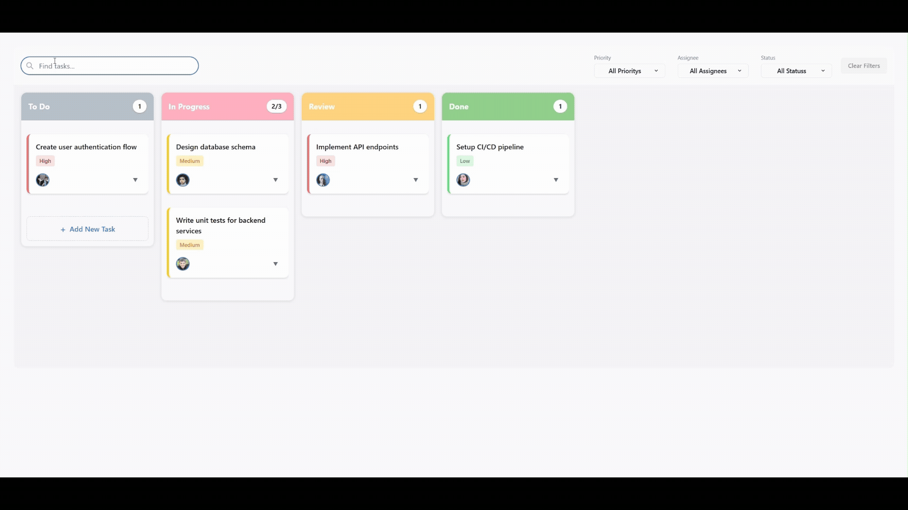
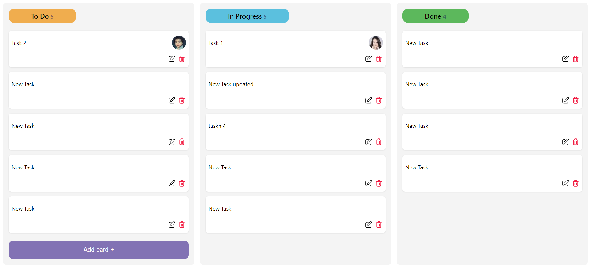

# KanbanBoard Component

A flexible and customizable Kanban board component for applications. The `KanbanBoard` component allows you to create interactive and draggable task cards organized into columns, making it ideal for project management and task tracking.

### KanbanBoard Component

Here are some visual examples of the Kanban board component:

- 
- 

## Features

- **Drag and Drop Functionality:** Move task cards between columns with mouse, touch, or keyboard (powered by [dnd-kit](https://dndkit.com/))
- **Customizable Card Rendering:** Tailor the appearance of task cards to fit your design
- **Add, Edit, and Delete Tasks:** Manage tasks directly from the Kanban board
- **Support for Avatars:** Display avatars on task cards for better team representation
- **Custom Search Interface:** Replace the default search with your own implementation
- **Custom Filter Menus:** Create advanced filter controls using your preferred UI library
- **WIP Limits:** Set limits on the number of cards allowed in each column
- **Card Details with Expand/Collapse:** Show or hide detailed information for each card
- **Dynamic Filtering:** Filter cards by various properties (priority, assignee, status)
- **Search Functionality:** Search for cards by title
- **UI Library Integration:** Seamlessly integrate with popular UI libraries like Chakra UI
- **Responsive Design:** Works on desktop and mobile devices — touch dragging with press-and-hold
- **Keyboard Accessible Drag-and-Drop:** Focus a card, press <kbd>Space</kbd> to pick it up, arrow keys to move (including across columns), <kbd>Space</kbd>/<kbd>Enter</kbd> to drop, <kbd>Esc</kbd> to cancel — with screen-reader announcements

## Installation

Install the `KanbanBoard` component via NPM:

```bash
npm install react-custom-kanban-board
```

or using yarn:

```bash
yarn add react-custom-kanban-board
```

## Usage

### Basic Example

Import and use the Kanban board in your React project:

```jsx
import React from "react";
import KanbanBoard from "react-custom-kanban-board";

const columns = [
  { title: "To Do", key: "todo", color: "#BDBDCD" },
  { title: "In Progress", key: "in-progress", color: "#FDDDE3" },
  { title: "Done", key: "done", color: "#71C781" },
];

const initialCards = [
  {
    id: "1",
    title: "Task 1",
    status: "todo",
    avatarPath: "https://i.pravatar.cc/40?img=1",
  },
  {
    id: "2",
    title: "Task 2",
    status: "in-progress",
    avatarPath: "https://i.pravatar.cc/40?img=2",
  },
];

const App = () => {
  return (
    <div>
      <h1>My Kanban Board</h1>
      <KanbanBoard
        columns={columns}
        initialCards={initialCards}
        columnForAddCard="todo"
      />
    </div>
  );
};

export default App;
```

### Advanced Example with Chakra UI Integration

Here's how to integrate the Kanban board with Chakra UI for enhanced UI components:

```jsx
import React, { useState, useEffect, useRef } from "react";
import KanbanBoard from "react-custom-kanban-board";
import {
  ChakraProvider,
  InputGroup,
  Input,
  InputLeftElement,
  InputRightElement,
  IconButton,
  Box,
  Text,
  Menu,
  MenuButton,
  MenuList,
  MenuItem,
  Button,
  Divider,
  extendTheme,
} from "@chakra-ui/react";
import { SearchIcon, ChevronDownIcon, CloseIcon } from "@chakra-ui/icons";
import "./App.css";

// Create a theme
const theme = extendTheme({
  // Your theme customizations here (optional)
});

const App = () => {
  // Sample columns with WIP limits
  const columns = [
    { title: "To Do", key: "todo", color: "#B8C2CC" },
    { title: "In Progress", key: "in-progress", color: "#FFB1C1", limit: 3 }, // WIP limit
    { title: "Review", key: "review", color: "#FFD580" },
    { title: "Done", key: "done", color: "#91D18B" },
  ];

  // Sample cards data
  const initialCards = [
    {
      id: "1",
      title: "Create user authentication flow",
      status: "todo",
      avatarPath: "https://i.pravatar.cc/40?img=1",
      priority: "High",
      dueDate: "2023-06-30",
      tags: ["frontend", "auth"],
      description:
        "Implement user registration, login, and password reset flows.",
      assignee: "john",
    },
    // ... more cards
  ];

  // Filter configurations
  const filterConfigs = [
    {
      field: "priority",
      label: "Priority",
      options: [
        { value: "High", label: "High Priority" },
        { value: "Medium", label: "Medium Priority" },
        { value: "Low", label: "Low Priority" },
      ],
    },
    // ... more filter configs
  ];

  const [cards, setCards] = useState(initialCards);
  const [loading, setLoading] = useState(true);

  // Simulate loading data
  useEffect(() => {
    setTimeout(() => {
      setLoading(false);
    }, 1500);
  }, []);

  // Custom Search Input Component using Chakra UI
  const CustomSearchInput = ({ searchTerm, setSearchTerm }) => {
    const inputRef = useRef(null);

    return (
      <InputGroup size="md" maxW="400px">
        <InputLeftElement pointerEvents="none">
          <SearchIcon color="gray.400" />
        </InputLeftElement>
        <Input
          ref={inputRef}
          value={searchTerm}
          onChange={(e) => setSearchTerm(e.target.value)}
          placeholder="Find tasks..."
          borderRadius="full"
          bg="white"
          borderColor="gray.300"
        />
        {searchTerm && (
          <InputRightElement>
            <IconButton
              size="sm"
              variant="ghost"
              icon={<CloseIcon w={3} h={3} />}
              onClick={() => {
                setSearchTerm("");
                inputRef.current?.focus();
              }}
              aria-label="Clear search"
            />
          </InputRightElement>
        )}
      </InputGroup>
    );
  };

  // Custom Filter Menu Component using Chakra UI
  const CustomFilterMenu = ({ config, selectedValue, onChange }) => {
    const selectedOption = config.options.find(
      (opt) => opt.value === selectedValue
    );
    const displayValue = selectedOption
      ? selectedOption.label
      : `All ${config.label}s`;

    return (
      <Box mx={2}>
        <Text fontSize="xs" color="gray.500" mb={1}>
          {config.label}
        </Text>
        <Menu closeOnSelect={true}>
          <MenuButton
            as={Button}
            rightIcon={<ChevronDownIcon />}
            size="sm"
            variant="outline"
            w="160px"
          >
            {displayValue}
          </MenuButton>
          <MenuList zIndex={100}>
            <MenuItem
              onClick={() => onChange(config.field, null)}
              fontWeight={!selectedValue ? "bold" : "normal"}
            >
              All {config.label}s
            </MenuItem>
            <Divider />
            {config.options.map((option) => (
              <MenuItem
                key={option.value}
                onClick={() => onChange(config.field, option.value)}
                fontWeight={selectedValue === option.value ? "bold" : "normal"}
              >
                {option.label}
              </MenuItem>
            ))}
          </MenuList>
        </Menu>
      </Box>
    );
  };

  // Wrapper functions to match the expected function signature
  const customSearchWrapper = (searchTerm, setSearchTerm) => {
    return (
      <CustomSearchInput
        searchTerm={searchTerm}
        setSearchTerm={setSearchTerm}
      />
    );
  };

  const customFilterWrapper = (config, selectedValue, onChange) => {
    return (
      <CustomFilterMenu
        config={config}
        selectedValue={selectedValue}
        onChange={onChange}
      />
    );
  };

  return (
    <ChakraProvider theme={theme}>
      <div className="app-container">
        <header className="app-header">
          <h1>Project Task Board</h1>
        </header>

        <main className="board-container">
          <KanbanBoard
            columns={columns}
            initialCards={cards}
            columnForAddCard="todo"
            isLoading={loading}
            emptyColumnMessage="No tasks yet"
            enableSearch={true}
            enableFiltering={true}
            filterConfigs={filterConfigs}
            renderSearchInput={customSearchWrapper}
            renderFilterMenu={customFilterWrapper}
          />
        </main>
      </div>
    </ChakraProvider>
  );
};

export default App;
```

## Theming

The board is styled entirely through `--kb-*` CSS variables (design tokens), so
you can reskin it without fighting selector specificity. Override them globally
on `:root`, or scope them to one board via the `className` / `style` props.

A ready-made dark theme ships as `.kb-dark`:

```jsx
<KanbanBoard className="kb-dark" columns={columns} initialCards={cards} columnForAddCard="todo" />
```

Or set your own tokens inline / in a scoped class:

```jsx
<KanbanBoard
  columns={columns}
  initialCards={cards}
  columnForAddCard="todo"
  style={{
    ["--kb-accent"]: "#7c3aed",
    ["--kb-card-radius"]: "16px",
    ["--kb-priority-high"]: "#e11d48",
  }}
/>
```

Key tokens (see `src/KanbanBoard.css` for the full set):

| Token | Purpose |
| --- | --- |
| `--kb-board-bg` / `--kb-column-bg` / `--kb-card-bg` | Surfaces |
| `--kb-text` / `--kb-text-muted` | Text |
| `--kb-accent` / `--kb-hover-bg` | Accent & interaction |
| `--kb-border` / `--kb-radius` / `--kb-card-radius` | Lines & radii |
| `--kb-shadow` / `--kb-shadow-hover` | Elevation |
| `--kb-priority-high` / `--kb-priority-medium` / `--kb-priority-low` | Priority accents |
| `--kb-font` | Font family |

> Previous variable names (`--card-bg`, `--accent-color`, …) still work as
> aliases, so existing overrides keep functioning.

## Virtualization (experimental)

For boards with very large columns (hundreds of cards), set
`virtualizeColumnsOver` to window each column's list so only the visible cards
are rendered. It's **off by default** and fully non-breaking.

```jsx
<KanbanBoard
  columns={columns}
  initialCards={cards}
  columnForAddCard="todo"
  virtualizeColumnsOver={50} // window any column with > 50 cards
  virtualItemEstimatedHeight={120}
/>
```

In testing, a 300-card column dropped from ~6,200 DOM nodes to ~350 (only ~13
cards rendered). Drag-and-drop (mouse, touch, keyboard) keeps working for
visible cards, and the `onCardMove` / `DropPosition` contract is unchanged.

> **⚠️ Caveats (why it's experimental):**
>
> - **No auto-scroll to off-screen targets while dragging.** You can reorder
>   among the cards currently in view, but you can't drag a card to a position
>   that's scrolled out of view in one motion — scroll to the target area first,
>   then drag. (Auto-scroll-during-drag for windowed columns is planned.)
> - No live "make room" shift animation inside virtualized columns.
> - Best for read-heavy large boards; if you need long-distance drags across a
>   huge column, leave virtualization off for that board.

## Controlled vs. uncontrolled

The board works in two modes:

**Uncontrolled (default)** — pass `initialCards` and let the board own its state.
It seeds once on mount; use the callbacks (`onCardMove`, `onCardEdit`,
`onCardDelete`, `onCardsChange`) to observe changes.

```jsx
<KanbanBoard columns={columns} initialCards={initialCards} columnForAddCard="todo" />
```

**Controlled** — pass `cards` and `onCardsChange`. The board renders `cards`
directly and never mutates internal state, so it stays perfectly in sync with a
backend or external store. Every change hands you the full next list.

```jsx
import { ControlledKanbanBoard } from "react-custom-kanban-board";

const [cards, setCards] = useState(initialCards);

<ControlledKanbanBoard
  columns={columns}
  columnForAddCard="todo"
  cards={cards}
  onCardsChange={setCards} // persist to your backend here too
/>;
```

`ControlledKanbanBoard` is a thin, type-safe wrapper that makes `cards` and
`onCardsChange` required. You can also just pass `cards` + `onCardsChange` to the
regular `KanbanBoard`.

> **⚠️ Migration (v2 → v3):**
>
> - **State:** In v2, changing `initialCards` after mount reset the board. As of
>   v3, `initialCards` is **uncontrolled** and seeds state only once — later
>   changes are ignored. If you were updating `initialCards` from a backend,
>   switch to controlled mode (`cards` + `onCardsChange`).
> - **Drag-and-drop:** v3 replaces native HTML5 drag-and-drop with
>   [dnd-kit](https://dndkit.com/) for touch and keyboard support. The board now
>   requires `@dnd-kit/core`, `@dnd-kit/sortable`, and `@dnd-kit/utilities`
>   (installed automatically as dependencies).
> - **`renderCard`:** the second argument changed from `handleDragStart` to
>   `isDragging: boolean`. Custom cards no longer need to wire drag events — the
>   whole card is a drag handle. Remove any `draggable`/`onDragStart` you added.

## Props

> **📖 Authoritative API reference:** [`docs/API.md`](./docs/API.md) is generated
> directly from the TypeScript source (`npm run docs`) and never drifts from the
> actual types. The tables below are a hand-maintained summary; when in doubt,
> trust the generated reference.

### KanbanBoard Component Props

| Prop                  | Type                                                                                                                                                              | Default          | Description                                                                                                           |
| --------------------- | ----------------------------------------------------------------------------------------------------------------------------------------------------------------- | ---------------- | --------------------------------------------------------------------------------------------------------------------- |
| `columns`             | `Column[]`                                                                                                                                                        | `[]`             | Array of columns to display. Each object should include `title`, `key`, and `color`.                                  |
| `initialCards`        | `Card[]`                                                                                                                                                          | `[]`             | **Uncontrolled mode.** Seeds the board's internal card state once, on mount. Later changes to this prop are ignored (see [Controlled vs. uncontrolled](#controlled-vs-uncontrolled)). |
| `cards`               | `Card[]`                                                                                                                                                          | -                | **Controlled mode.** When provided, the board renders these cards directly and never mutates internal state. Pair with `onCardsChange`. |
| `onCardsChange`       | `(cards: Card[]) => void`                                                                                                                                         | -                | Called with the full next card list on every mutation (move, edit, delete, add). Required for controlled mode; also fires in uncontrolled mode. |
| `className`           | `string`                                                                                                                                                          | -                | Applied to the board root — use it to scope a theme (e.g. `"kb-dark"`). See [Theming](#theming). |
| `style`               | `React.CSSProperties`                                                                                                                                             | -                | Applied to the board root — handy for setting `--kb-*` tokens inline.                                |
| `columnForAddCard`    | `string`                                                                                                                                                          | -                | Key of the column where new cards will be added.                                                                      |
| `onCardMove`          | `(cardId: string, newStatus: string, position: DropPosition) => void`                                                                                             | -                | Callback when a card is moved. Fires for both cross-column moves **and** same-column reordering. `position` exposes where the card landed within the destination column. |
| `onCardEdit`          | `(cardId: string, newTitle: string) => void`                                                                                                                      | -                | Callback function when a card is edited.                                                                              |
| `onCardDelete`        | `(cardId: string) => void`                                                                                                                                        | -                | Callback function when a card is deleted.                                                                             |
| `onTaskAddedCallback` | `(title: string) => void`                                                                                                                                         | -                | Callback function when a new task is added.                                                                           |
| `renderCard`          | `(card: Card, isDragging?: boolean, isExpanded?: boolean, toggleExpand?: (id: string) => void) => ReactNode`                                                       | -                | Custom function to render cards. The card is wrapped in a drag handle automatically — you no longer wire up drag events yourself. `isDragging` is `true` for the card being dragged. |
| `renderAvatar`        | `(avatarPath?: string) => ReactNode`                                                                                                                              | -                | Custom function to render avatars.                                                                                    |
| `renderAddCard`       | `(column: string, setCards: React.Dispatch<React.SetStateAction<Card[]>>) => ReactNode`                                                                           | -                | Custom function to render the add card button.                                                                        |
| `isLoading`           | `boolean`                                                                                                                                                         | `false`          | Shows loading spinner when true.                                                                                      |
| `loadingComponent`    | `ReactNode`                                                                                                                                                       | -                | Custom loading component.                                                                                             |
| `emptyColumnMessage`  | `string`                                                                                                                                                          | `"No cards yet"` | Default message shown when a column is empty (a column's `emptyMessage` overrides this).                              |
| `renderColumnLoading` | `(column: Column) => ReactNode`                                                                                                                                   | -                | Custom per-column loading UI, shown for any column with `isLoading: true`. Falls back to a built-in skeleton.         |
| `enableColumnReorder` | `boolean`                                                                                                                                                         | `false`          | Enable drag-to-reorder of columns via a grip in each column header (mouse, touch, keyboard).                          |
| `onColumnsReorder`    | `(orderedKeys: string[]) => void`                                                                                                                                 | -                | Called with the new ordered column keys after a column is reordered.                                                  |
| `deleteConfirmation`  | `"immediate" \| "confirm" \| "undo"`                                                                                                                              | `"immediate"`    | Guards card deletion before `onCardDelete` fires. `confirm` shows an inline prompt; `undo` removes the card and shows a brief undo toast, deferring `onCardDelete`. |
| `virtualizeColumnsOver` | `number`                                                                                                                                                        | -                | **Experimental.** Virtualize (window) a column's list once it exceeds this many cards, for large-board performance. See [Virtualization](#virtualization-experimental) for caveats. |
| `virtualItemEstimatedHeight` | `number`                                                                                                                                                   | `120`            | Estimated card height (px) used by the virtualizer.                                                                  |
| `undoDuration`        | `number`                                                                                                                                                          | `5000`           | How long (ms) the undo toast stays before the delete is committed (only used with `deleteConfirmation="undo"`).       |
| `enableSearch`        | `boolean`                                                                                                                                                         | `false`          | Enable search functionality.                                                                                          |
| `enableFiltering`     | `boolean`                                                                                                                                                         | `false`          | Enable filtering functionality.                                                                                       |
| `filterConfigs`       | `FilterConfig[]`                                                                                                                                                  | `[]`             | Configuration for filters.                                                                                            |
| `onFilterChange`      | `(filters: Record<string, string \| null>) => void`                                                                                                               | -                | Callback when filters change.                                                                                         |
| `renderSearchInput`   | `(searchTerm: string, setSearchTerm: (term: string) => void) => ReactNode`                                                                                        | -                | Custom function to render search input.                                                                               |
| `renderFilterMenu`    | `(config: FilterConfig, value: string \| null, handleFilterChange: (field: string, value: string \| null) => void) => ReactNode`                                  | -                | Custom function to render filter menu.                                                                                |

### Column Interface

| Property | Type     | Description                        |
| -------- | -------- | ---------------------------------- |
| `title`        | `string`  | Title of the column.                                                        |
| `key`          | `string`  | Unique key for the column.                                                  |
| `color`        | `string`  | Background color for the column.                                            |
| `limit`        | `number`  | Optional WIP limit for the column.                                         |
| `isLoading`    | `boolean` | Optional per-column loading state (e.g. lazy-loaded data). Shows a skeleton or `renderColumnLoading`. |
| `emptyMessage` | `string`  | Optional per-column empty message; overrides the board's `emptyColumnMessage`. |

### Card Interface

| Property        | Type       | Description                                     |
| --------------- | ---------- | ----------------------------------------------- |
| `id`            | `string`   | Unique identifier for the card.                 |
| `title`         | `string`   | Title of the card.                              |
| `status`        | `string`   | Status of the card, corresponds to column key.  |
| `avatarPath`    | `string`   | URL to the avatar image.                        |
| `priority`      | `string`   | Priority level (e.g., "High", "Medium", "Low"). |
| `dueDate`       | `string`   | Due date for the card.                          |
| `tags`          | `string[]` | Array of tags for the card.                     |
| `description`   | `string`   | Detailed description of the card.               |
| `assignee`      | `string`   | Person assigned to the card.                    |
| `[key: string]` | `any`      | Any additional custom properties you need.      |

### DropPosition Interface

Passed as the third argument to `onCardMove`, describing where the card landed within its destination column. This makes it easy to persist ordering on a backend (e.g. by storing the previous/next task ids).

| Property     | Type             | Description                                                                            |
| ------------ | ---------------- | -------------------------------------------------------------------------------------- |
| `prevTaskId` | `string \| null` | Id of the card immediately **before** the dropped card, or `null` if dropped at the top.    |
| `nextTaskId` | `string \| null` | Id of the card immediately **after** the dropped card, or `null` if dropped at the bottom.  |
| `index`      | `number`         | Zero-based index of the dropped card within the destination column.                    |

```jsx
<KanbanBoard
  columns={columns}
  initialCards={cards}
  columnForAddCard="todo"
  onCardMove={(cardId, newStatus, { prevTaskId, nextTaskId, index }) => {
    // Persist the new ordering on your backend
    api.reorderTask({ cardId, column: newStatus, prevTaskId, nextTaskId, index });
  }}
/>
```

### FilterConfig Interface

| Property  | Type             | Description                                        |
| --------- | ---------------- | -------------------------------------------------- |
| `field`   | `string`         | Field to filter by (e.g., "priority", "assignee"). |
| `label`   | `string`         | Display label for the filter.                      |
| `options` | `FilterOption[]` | Array of available filter options.                 |

### FilterOption Interface

| Property | Type     | Description                          |
| -------- | -------- | ------------------------------------ |
| `value`  | `string` | Value of the filter option.          |
| `label`  | `string` | Display label for the filter option. |

## Development

```bash
npm install        # install deps
npm run dev        # preview the component (demo/) at http://localhost:5173
npm run build      # compile the library to dist/
npm run docs       # regenerate docs/API.md from the TypeScript source
npm test           # run the Playwright end-to-end suite (drives the demo)
```

The end-to-end tests in `test/` drive the demo app (which renders the library
straight from `src/`), so they exercise real drag-and-drop, delete, loading, and
controlled/uncontrolled behavior in a browser.

## Contributing

Contributions are welcome! Please open an issue or submit a pull request on GitHub.

## Contact

For any questions or issues, please contact [HamdyIIbarhim](mailto:hamdyfarouk444@gmail.com).
